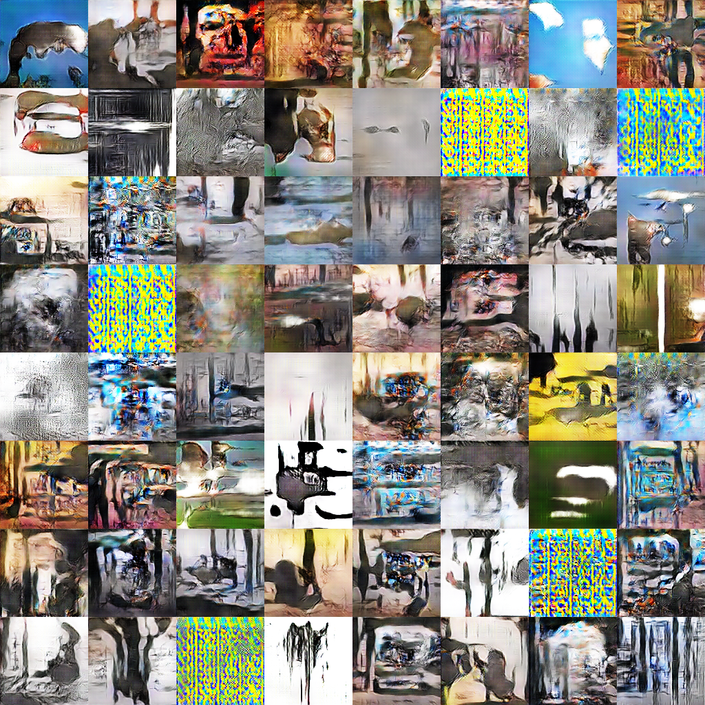

# Visual Illusions
Can we teach a machine to generate new visual illusions? 

## Dataset

* https://github.com/robertmaxwilliams/optical-illusion-dataset
* https://www.moillusions.com/
* http://viperlib.york.ac.uk/
* https://twitter.com/AkiyoshiKitaoka
* http://www.psy.ritsumei.ac.jp/~akitaoka/saishin58e.html -- dating back to June 2002 (http://www.psy.ritsumei.ac.jp/~akitaoka/o1saishe.html)

## Details, Categories and Meta Data

https://en.wikipedia.org/wiki/List_of_optical_illusions

## Related work

Deep Neural Networks are Easily Fooled: High Confidence Predictions for Unrecognizable Images (https://arxiv.org/abs/1412.1897)

Optical Illusions Images Dataset
(https://arxiv.org/abs/1810.00415)

* Handpicked (https://www.floydhub.com/robertmax/datasets/illusions-filtered)
* Total dataset (https://www.floydhub.com/robertmax/datasets/illusions-jpg)
